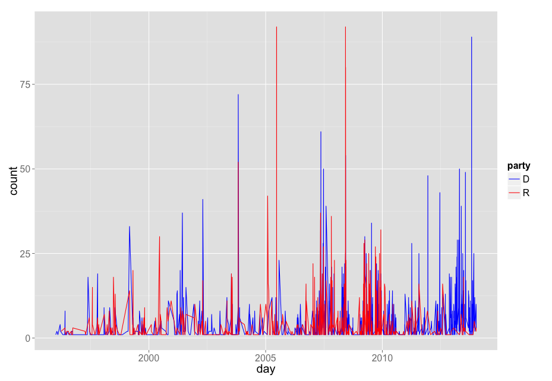

rsunlight
======

[](https://travis-ci.org/rOpenGov/rsunlight)

+ Maintainer: Scott Chamberlain
+ License: [MIT](http://creativecommons.org/publicdomain/zero/1.0/)
+ Report any problems in the [Issues Tracker](https://github.com/SChamberlain/rOpenGov/issues), or just fork and submit changes, etc.

## Description

`rsunlight` is a collection of functions to search and acquire data from the various Sunlight Labs APIs for government data, at http://services.sunlightlabs.com/.

`rsunlight` wraps functions in APIs for:

 * Sunlight Labs Congress API (`cg`)
 * Sunlight Labs Transparency API (`ts`)
 * Sunlight Labs Open States API (`os`)
 * Sunlight Labs Real Time Congress API (`rt`) 
 * Sunlight Labs Capitol Words API (`cw`)
 * Sunlight Labs Influence Explorer API (`ie`)

Functions that wrap these sets of APIs will be prefixed by `cg`, `ts`, `os`, `rt`, `cw`, or `ie` for the different methods listed above:

 * `cg` + `fxn` 
 * `ts` + `fxn` 
 * `os` + `fxn` 
 * `rt` + `fxn` 
 * `cw` + `fxn`
 * `ie` + `fxn`

where `fxn` would be a function to a interface with a specific Sunlight Foundation API. 

Please get your own API keys if you plant to use these functions for Sunlight Labs (http://services.sunlightlabs.com/).

Data from the Sunlight Foundation API is provided by Sunlight Foundation.

<a border="0" href="http://services.sunlightlabs.com/" ></a>

We set up the functions so that you can put the key in your .Rprofile file, which will be called on startup of R, and then you don't have to enter your API key for each run of a function. For example, put this in your `.Rprofile` file:

```
# key for API access to the Sunlight Labs API methods
options(SunlightLabsKey = "YOURKEYHERE")
```

**Note** that Puerto Rico is not included in Sunlight Foundation data.

## Quickstart

If you store your key in your `.Rprofile` file it will be read inside of each function call. Or you can pass your key into each function call manually by `key=yourkey`. 

### Install rsunlight

```coffee
install.packages("devtools")
library(devtools)
install_github("ropengov/rsunlight")
```

### Load rsunlight

```coffee
library("rsunlight")
```

### Get districts for a latitude/longitude.

```coffee
(out <- cg_getdistrictlatlong(latitude = 35.778788, longitude = -78.787805))
```

```coffee
$districts
$districts[[1]]
$districts[[1]]$district
$districts[[1]]$district$state
[1] "NC"

$districts[[1]]$district$number
[1] "2"
```

### Search congress people and senate members.

```coffee
out <- cg_getlegislatorsearch(name = 'Reed')
out$results[[1]]$result$legislator[1:5]
```

```coffee
$website
[1] "http://reed.house.gov"

$fax
[1] "202-226-6599"

$govtrack_id
[1] "412393"

$firstname
[1] "Tom"

$chamber
[1] "house"
```

### Find the popularity of a phrase over a period of time.

Get a list of how many times the phrase "united states" appears in the Congressional Record in each month between January and June, 2010:

```coffee
cw_timeseries(phrase='united states', start_date='2009-01-01', end_date='2009-04-30', granularity='month')
```

```coffee
  count      month
1  3805 2009-01-01
2  3512 2009-02-01
3  6018 2009-03-01
4  2967 2009-04-01
```

#### Plot data

```coffee
library(ggplot2)
dat_d <- cw_timeseries(phrase='climate change', party="D")
dat_d$party <- rep("D", nrow(dat_d))
dat_r <- cw_timeseries(phrase='climate change', party="R")
dat_r$party <- rep("R", nrow(dat_r))
dat_both <- rbind(dat_d, dat_r)
ggplot(dat_both, aes(day, count, colour=party)) + 
  geom_line() + 
  theme_grey(base_size=20) + 
  scale_colour_manual(values=c("blue","red"))
```



### Interactive charts using rCharts

Note that the resulting chart opens in a browser, so is not shown in this vignette, but you will see it open in a browser when you run the code.

```coffee
dream <- lapply(c('D','R'), function(x) cw_timeseries(phrase='i have a dream', party=x, start_date='1996-01-01', end_date='2013-01-01', granularity='month'))
df <- merge(dream[[1]], dream[[2]], by='month', all=TRUE)
df[is.na(df)] <- 0
names(df) <- c('date','D','R')
df$date <- as.character(df$date)
```

```coffee
library(rCharts)
m1 <- mPlot(x = "date", y = c("D", "R"), type = "Line", data = df)
m1$set(pointSize = 0, lineWidth = 1)
m1
```

_note: as you can see this is not actually interactive, but when you make it, it will be_


### Return the top contributoring organizations

Ranked by total dollars given. An organization's giving is broken down into money given directly (by the organization's PAC) versus money given by individuals employed by or associated with the organization.

```coffee
out <- ts_aggregatetopcontribs(id = '85ab2e74589a414495d18cc7a9233981')
library(plyr)
ldply(out, data.frame)
```

```coffee
   employee_amount total_amount total_count                                     name direct_count employee_count                               id direct_amount
1         64000.00    101300.00          79                         Akin, Gump et al           16             63 105dcfc8c9384875a099af230dad9917      37300.00
2          3500.00     95000.00          30 American Fedn of St/Cnty/Munic Employees           26              4 fb702029157e4c7c887172eba71c66c5      91500.00
3                0     91600.00          49                National Assn of Realtors           49              0 bb98402bd4d3471cad392a671ecd733a      91600.00
4                0     85000.00          32                      United Auto Workers           32              0 4d3167b97c9f48deb433aad57bb0ee44      85000.00
5                0     83500.00          38                  National Education Assn           38              0 1b8fea7e453d4e75841eac48ff9df550      83500.00
6                0     82500.00          23                Sheet Metal Workers Union           23              0 425be85642b24cc2bc3d8a0bb3c7bc92      82500.00
7                0     77500.00          19   Intl Brotherhood of Electrical Workers           19              0 b53b4ad137d743a996f4d7467700fc88      77500.00
8                0     77000.00          19                          Teamsters Union           19              0 f89c8e3ab2b44f72971f91b764868231      77000.00
9                0     76000.00          36         National Assn of Letter Carriers           36              0 390767dc6b4b491ca775b1bdf8a36eea      76000.00
10               0     74600.00          22               Plumbers/Pipefitters Union           22              0 c869c8e293614e10960b2e77f5eabecd      74600.00
```