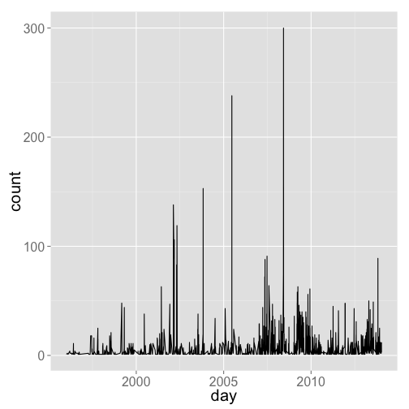
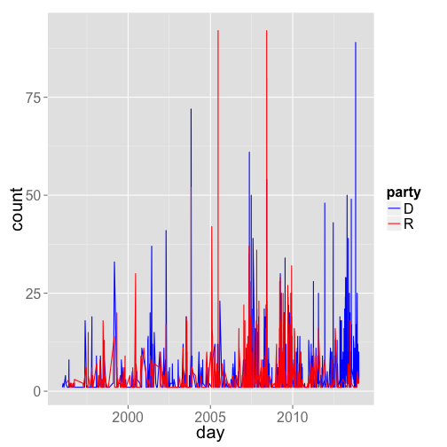

<!--
%\VignetteEngine{knitr}
%\VignetteIndexEntry{rsunlight vignette}
-->

rsunlight vignette - Interface to Sunlight Labs APIs.
======

### About the package

`rsunlight` is an R package to search and retrieve data from the Sunlight Labs APIs. 


Returned objects from functions are simple lists. That is, you likely will want to take output objects and make data.frames, vectors, matrices, etc. In future versions of rsunlight, I will return data.frame's when possible as those are easy to work with in R for beginners, though advanced users probably like lists more (I'm guessing, or just the raw JSON, eh)?

********************


#### Install rsunlight


```r
install.packages("devtools")
library(devtools)
install_github("rsunlight", "ropengov")
```


********************

#### Load rsunlight and other dependency libraries


```r
library(rsunlight)
```


********************

#### Gets details (subcommittees + membership) for a committee by id.


```r
out <- sll_cg_getcommittees(id = "JSPR")
out$response$committee$members[[1]]$legislator[1:5]
```

```
## $website
## [1] "http://www.alexander.senate.gov"
## 
## $fax
## [1] "202-228-3398"
## 
## $govtrack_id
## [1] "300002"
## 
## $firstname
## [1] "Lamar"
## 
## $chamber
## [1] "senate"
```


********************

#### Gets a list of all committees that a member serves on, including subcommittes.


```r
out <- sll_cg_getcommitteesallleg(bioguide_id = "S000148")
out$response$committees[[1]]
```

```
## $committee
## $committee$chamber
## [1] "Senate"
## 
## $committee$id
## [1] "SSRA"
## 
## $committee$name
## [1] "Senate Committee on Rules and Administration"
```


********************

#### Get districts for a latitude/longitude.


```r
out <- sll_cg_getdistrictlatlong(latitude = 35.778788, longitude = -78.787805)
out$response$districts
```

```
## [[1]]
## [[1]]$district
## [[1]]$district$state
## [1] "NC"
## 
## [[1]]$district$number
## [1] "2"
```


********************

#### Get districts that overlap for a certain zip code.


```r
out <- sll_cg_getdistrictzip(zip = 27511)
out$response$districts
```

```
## [[1]]
## [[1]]$district
## [[1]]$district$state
## [1] "NC"
## 
## [[1]]$district$number
## [1] "2"
## 
## 
## 
## [[2]]
## [[2]]$district
## [[2]]$district$state
## [1] "NC"
## 
## [[2]]$district$number
## [1] "4"
## 
## 
## 
## [[3]]
## [[3]]$district
## [[3]]$district$state
## [1] "NC"
## 
## [[3]]$district$number
## [1] "13"
```


********************

#### Search congress people and senate members.


```r
out <- sll_cg_getlegislatorsearch(name = "Reed")
out$response$results[[1]]$result$legislator[1:5]
```

```
## $website
## [1] "http://www.reed.senate.gov"
## 
## $fax
## [1] "202-224-4680"
## 
## $govtrack_id
## [1] "300081"
## 
## $firstname
## [1] "John"
## 
## $chamber
## [1] "senate"
```


********************

#### Search congress people and senate members for a zip code.


```r
out <- sll_cg_legislatorsallforzip(zip = 77006)
library(plyr)
ldply(out$response$legislators, function(x) data.frame(x$legislator[c("firstname", 
    "lastname")]))
```

```
##   firstname    lastname
## 1    Sheila Jackson Lee
## 2       Ted        Cruz
## 3      John      Cornyn
## 4       Ted         Poe
```


********************

#### Find the popularity of a phrase over a period of time.

##### Get a list of how many times the phrase "united states" appears in the Congressional Record in each month between January and June, 2010:


```r
sll_cw_timeseries(phrase = "united states", start_date = "2009-01-01", end_date = "2009-04-30", 
    granularity = "month")
```

```
## 4 records returned
```

```
##   count      month
## 1  3805 2009-01-01
## 2  3512 2009-02-01
## 3  6018 2009-03-01
## 4  2967 2009-04-01
```


##### Plot data


```r
library(ggplot2)
```

```
## Need help? Try the ggplot2 mailing list: http://groups.google.com/group/ggplot2.
```

```r
dat <- sll_cw_timeseries(phrase = "climate change")
```

```
## 1403 records returned
```

```r
ggplot(dat, aes(day, count)) + geom_line() + theme_grey(base_size = 20)
```

 


##### Plot more data


```r
dat_d <- sll_cw_timeseries(phrase = "climate change", party = "D")
```

```
## 953 records returned
```

```r
dat_d$party <- rep("D", nrow(dat_d))
dat_r <- sll_cw_timeseries(phrase = "climate change", party = "R")
```

```
## 631 records returned
```

```r
dat_r$party <- rep("R", nrow(dat_r))
dat_both <- rbind(dat_d, dat_r)
ggplot(dat_both, aes(day, count, colour = party)) + geom_line() + theme_grey(base_size = 20) + 
    scale_colour_manual(values = c("blue", "red"))
```

 


#### Interactive charts using rCharts

Note that the resulting chart opens in a browser, so is not shown in this vignette, but you will see it open in a browser when you run the code.


```r
dream <- lapply(c("D", "R"), function(x) sll_cw_timeseries(phrase = "i have a dream", 
    party = x, start_date = "1996-01-01", end_date = "2013-01-01", granularity = "month"))
df <- merge(dream[[1]], dream[[2]], by = "month", all = TRUE)
df[is.na(df)] <- 0
names(df) <- c("date", "D", "R")
df$date <- as.character(df$date)
# df <- ldply(dream, data.frame)

library(rCharts)
m1 <- mPlot(x = "date", y = c("D", "R"), type = "Line", data = df)
m1$set(pointSize = 0, lineWidth = 1)
m1
```


********************

#### Search OpenStates bills.


```r
out <- sll_os_billsearch(terms = "agriculture", state = "tx", chamber = "upper")
lapply(out, "[[", "title")[100:110]
```

```
## [[1]]
## [1] "Relating to the sale by the Brazos River Authority of certain property at Possum Kingdom Lake."
## 
## [[2]]
## [1] "Proposing a constitutional amendment providing immediate additional revenue for the state budget by creating the Texas Gaming Commission, and authorizing and regulating the operation of casino games and slot machines by a limited number of licensed operators and certain Indian tribes."
## 
## [[3]]
## [1] "Relating to production requirements for holders of winery permits."
## 
## [[4]]
## [1] "Relating to the use of human remains in the training of search and rescue animals."
## 
## [[5]]
## [1] "Relating to end-of-course assessment instruments administered to public high school students and other measures of secondary-level performance."
## 
## [[6]]
## [1] "Relating to public high school graduation, including curriculum and assessment requirements for graduation and funding in support of certain curriculum authorized for graduation."
## 
## [[7]]
## [1] "Relating to certain residential and other structures and mitigation of loss to those structures resulting from natural catastrophes; providing a criminal penalty."
## 
## [[8]]
## [1] "Recognizing March 28, 2013, as Texas Water Conservation Day at the State Capitol."
## 
## [[9]]
## [1] "Recognizing March 26, 2013, as Lubbock Day at the State Capitol."
## 
## [[10]]
## [1] "In memory of Steve Jones."
## 
## [[11]]
## [1] "Relating to the regulation of dangerous wild animals."
```


********************

#### Search Legislators on OpenStates. 


```r
out <- sll_os_legislatorsearch(state = "tx", party = "democratic", active = TRUE)
out[[1]][1:4]
```

```
## $last_name
## [1] "Naishtat"
## 
## $updated_at
## [1] "2014-01-14 00:42:31"
## 
## $nimsp_candidate_id
## [1] "112047"
## 
## $full_name
## [1] "Elliott Naishtat"
```


********************

#### Search for entities - that is, politicians, individuals, or organizations with the given name


```r
out <- sll_ts_aggregatesearch("Nancy Pelosi")
out <- lapply(out, function(x) {
    x[sapply(x, is.null)] <- "none"
    x
})
ldply(out, data.frame)
```

```
##                        name count_given firm_income count_lobbied
## 1          Nancy Pelosi (D)           0           0             0
## 2 Nancy Pelosi for Congress           7           0             0
##            seat total_received state lobbying_firm count_received party
## 1 federal:house       14731364    CA          none          10321     D
## 2          none              0  none          <NA>              0  none
##   total_given         type                               id
## 1           0   politician 85ab2e74589a414495d18cc7a9233981
## 2        7250 organization afb432ec90454c8a83a3113061e7be27
##   non_firm_spending is_superpac
## 1                 0        none
## 2                 0        <NA>
```


********************

#### Return the top contributoring organizations, ranked by total dollars given. An organization's giving is broken down into money given directly (by the organization's PAC) versus money given by individuals employed by or associated with the organization.


```r
out <- sll_ts_aggregatetopcontribs(id = "85ab2e74589a414495d18cc7a9233981")
ldply(out, data.frame)
```

```
##    employee_amount total_amount total_count
## 1         64000.00    101300.00          79
## 2          3500.00     95000.00          30
## 3                0     91600.00          49
## 4                0     85000.00          32
## 5                0     83500.00          38
## 6                0     82500.00          23
## 7                0     77500.00          19
## 8                0     77000.00          19
## 9                0     76000.00          36
## 10               0     74600.00          22
##                                        name direct_count employee_count
## 1                          Akin, Gump et al           16             63
## 2  American Fedn of St/Cnty/Munic Employees           26              4
## 3                 National Assn of Realtors           49              0
## 4                       United Auto Workers           32              0
## 5                   National Education Assn           38              0
## 6                 Sheet Metal Workers Union           23              0
## 7    Intl Brotherhood of Electrical Workers           19              0
## 8                           Teamsters Union           19              0
## 9          National Assn of Letter Carriers           36              0
## 10               Plumbers/Pipefitters Union           22              0
##                                  id direct_amount
## 1  105dcfc8c9384875a099af230dad9917      37300.00
## 2  fb702029157e4c7c887172eba71c66c5      91500.00
## 3  bb98402bd4d3471cad392a671ecd733a      91600.00
## 4  4d3167b97c9f48deb433aad57bb0ee44      85000.00
## 5  1b8fea7e453d4e75841eac48ff9df550      83500.00
## 6  425be85642b24cc2bc3d8a0bb3c7bc92      82500.00
## 7  b53b4ad137d743a996f4d7467700fc88      77500.00
## 8  f89c8e3ab2b44f72971f91b764868231      77000.00
## 9  390767dc6b4b491ca775b1bdf8a36eea      76000.00
## 10 c869c8e293614e10960b2e77f5eabecd      74600.00
```

